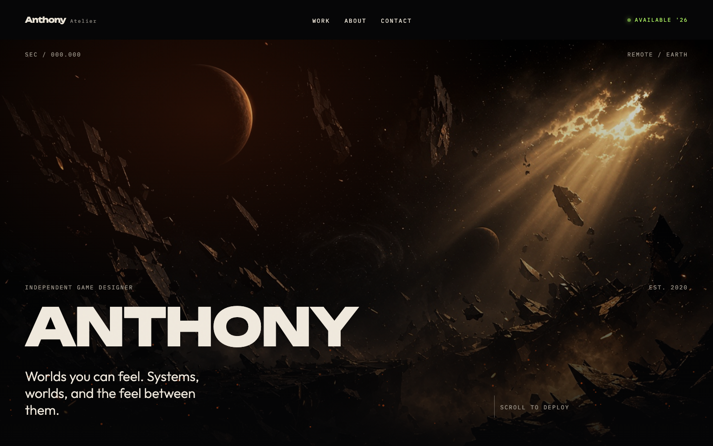
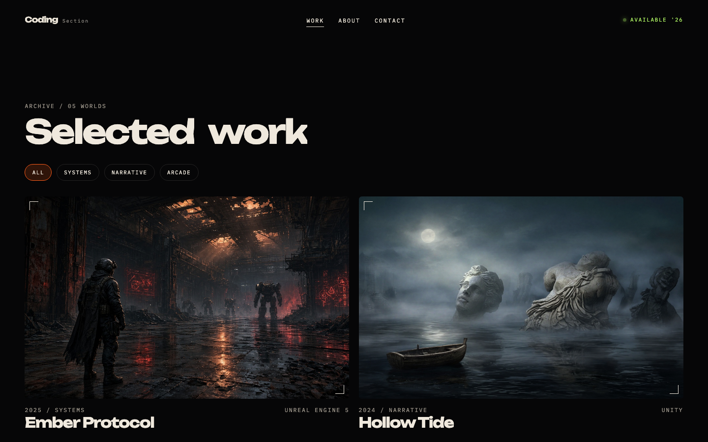
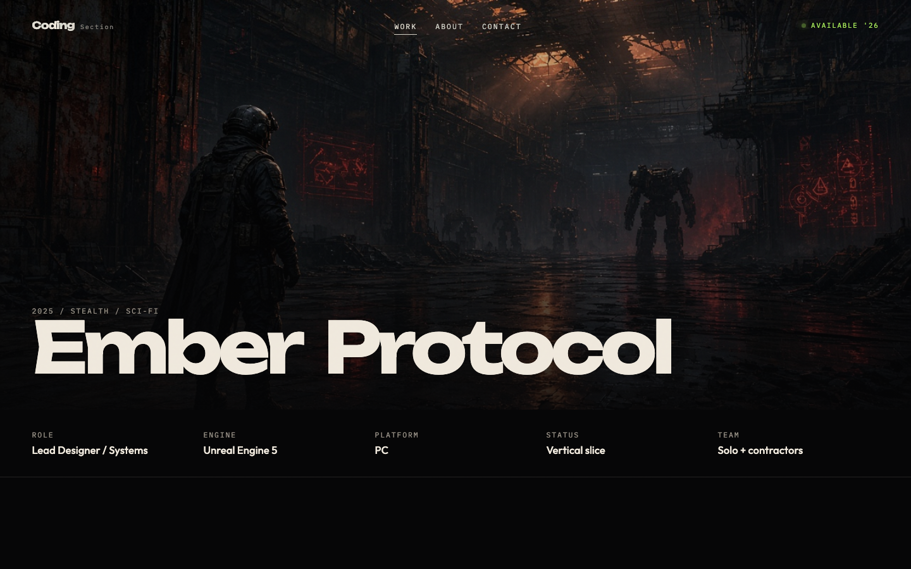
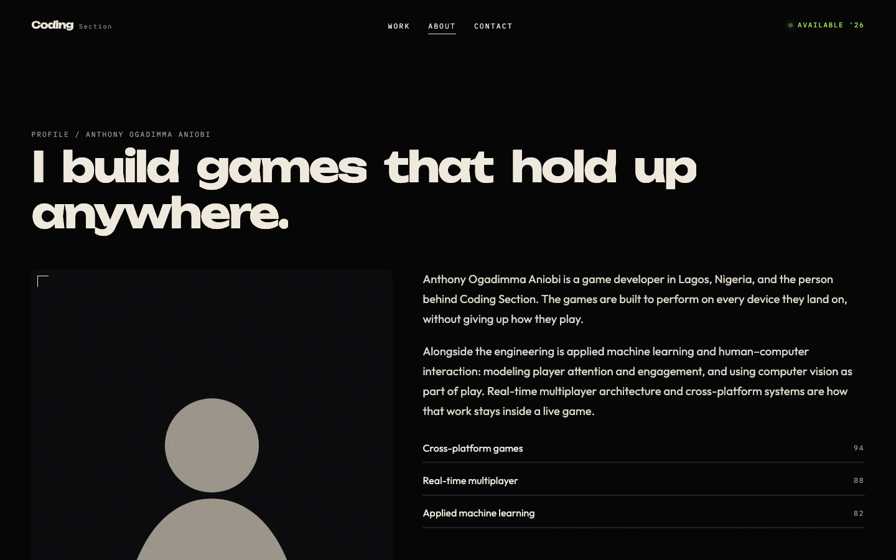
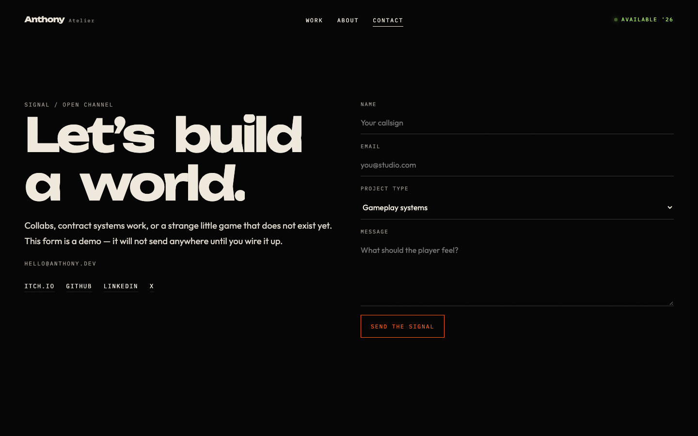

# Anthony Atelier

[](https://app.netlify.com/projects/codingsection/deploys)

A cinematic portfolio for a game designer and systems programmer. Dark studio chrome, full-screen route transitions, and a small archive of worlds — built to feel like a place, not a résumé.

## Preview



| Selected work | Project |
| --- | --- |
|  |  |

| About | Contact |
| --- | --- |
|  |  |

## Routes

| Path | Page |
| --- | --- |
| `/` | Home — hero, featured world, selected work |
| `/work` | Filterable archive (Systems, Narrative, Arcade) |
| `/work/:slug` | Project case page |
| `/about` | Profile, timeline, and toolkit |
| `/contact` | Contact form, delivered by Web3Forms |
| anything else | 404 |

Sample copy and five worlds (Ember Protocol, Hollow Tide, Neon Drift, Last Lantern, Dusk Array) are placeholders. Swap them before treating this as a personal site.

## Stack

Vite, React 19, TypeScript, React Router, and Framer Motion. Motion includes a boot sequence, a route veil, split titles, scroll reveals, a custom cursor, and magnetic buttons. `prefers-reduced-motion` turns the heavier motion off.

## Run it

```bash
npm install
npm run dev
```

Other scripts:

```bash
npm run build    # typecheck and write dist/
npm run preview  # serve the production build
npm run lint
```

## Edit the site

| What | Where |
| --- | --- |
| Name, role, email, socials, skills, timeline | `src/data/site.ts` |
| Worlds, credits, covers | `src/data/projects.ts` |
| Images | `public/images/` |
| Pages | `src/pages/` |
| Shared motion UI | `src/components/` |
| Color, type, layout | `src/index.css` |

The contact form posts to Web3Forms. Create an access key for `anthony@codingsection.com`, then copy `.env.example` to `.env.local` and set `VITE_WEB3FORMS_ACCESS_KEY`. That file stays off git.

## Deploy

Netlify builds with `npm run build` and publishes `dist`. `netlify.toml` rewrites every path to `index.html` so client-side routes survive a refresh. The badge above tracks the [codingsection](https://app.netlify.com/projects/codingsection/deploys) deploys.

The deploy workflow reads the `WEB3FORMS_ACCESS_KEY` repository secret and passes it to Vite as `VITE_WEB3FORMS_ACCESS_KEY`. The build stops if that secret is missing. The key is public in the shipped page; Web3Forms expects that. It only routes mail to the inbox you verified when you created the key.
